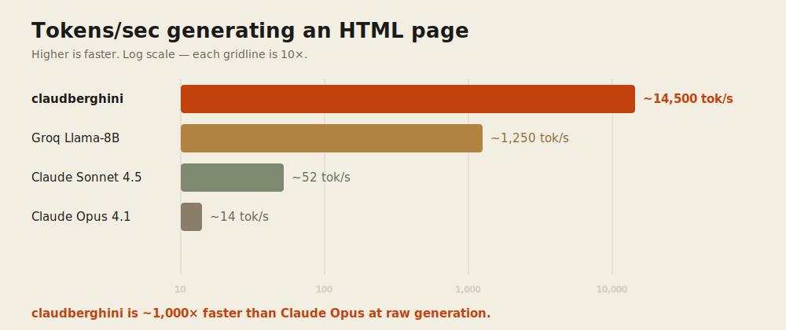

<p align="center">
  
</p>

<h1 align="center">claudberghini 🦞🏎️</h1>

<p align="center">
  <b>Claude Code, but the engine is silicon-baked Llama 3.1 8B doing <code>~14,500 tokens/sec</code>.</b><br>
  A tiny local proxy that speaks the Anthropic Messages API, so the full Claude Code harness
  drives the fastest model on Earth. Half lobster, half Lamborghini, all throughput.
</p>

<p align="center">
  <a href="https://dennisonbertram.github.io/claudberghini/">Website</a> ·
  <a href="#quickstart">Quickstart</a> ·
  <a href="#how-fast">How fast</a> ·
  <a href="#how-it-works">How it works</a> ·
  <a href="#the-story">The story</a> ·
  <a href="#safety">Safety</a>
</p>

---

## What is this?

[Taalas](https://taalas.com) bakes AI models **directly into custom silicon** — "the model
is the computer," ~1000× more efficient than running it on GPUs. Their public demo (which the
world knows as *ChatJimmy*) serves Llama&nbsp;3.1&nbsp;8B etched into a chip at an almost silly
speed: **~14,500 tokens/sec**, ~1.1&nbsp;ms to first token.

`claudberghini` straps that engine to [Claude&nbsp;Code](https://claude.com/claude-code). It's a
local proxy that:

- **Speaks the Anthropic Messages API** — so Claude Code (via [deep-claude](https://github.com/dennisonbertram/deep-claude)) talks to it unmodified.
- **Translates tool calls** — injects a tool-use format into the prompt and parses the model's text back into Anthropic `tool_use` blocks (the demo has no tools API).
- **Makes a weak 8B reliable** — best-of-N resampling, grounded answer selection, a tuned compact prompt, and a destructive-command guard.

The result is a real agentic coding loop — read, edit, create, search, run — on a model so fast
that drawing it **5× per turn** for reliability is *still* faster than a single Claude Opus call.

## How fast

<p align="center">
  
</p>

Same task — *"write a basic HTML page"* — measured end to end:

| Engine | Tokens/sec | vs claudberghini |
|--------|-----------:|------------------|
| **claudberghini** (Taalas silicon, Llama 3.1 8B) | **~14,500** | — |
| Groq (Llama 3.1 8B) | ~1,250 | 12× slower |
| Claude Sonnet 4.5 | ~52 | ~280× slower |
| Claude Opus 4.1 | ~14 | **~1,000× slower** |

> A full HTML page is **~8&nbsp;ms** of inference on claudberghini. Claude Opus spends ~9
> **seconds** on the same tokens. That's the headline: **~1,000× faster than Opus** — which,
> fittingly, is exactly the order of magnitude Taalas claims for silicon-baked models.

Reproduce: `./eval/speed-benchmark.sh` (claudberghini telemetry + end-to-end); the Opus/Sonnet
numbers via OpenRouter.

## Quickstart

### Requirements

- **macOS or Linux** · **[Claude Code](https://claude.com/claude-code)** on your `PATH` · **[deep-claude](https://github.com/dennisonbertram/deep-claude)** · **[Node.js](https://nodejs.org/) 18+**

### Install

```bash
git clone https://github.com/dennisonbertram/claudberghini
cd claudberghini
npm install && npm run build

# register the endpoint with deep-claude (one time)
deep-claude endpoints add claudberghini http://localhost:3000
```

### Run

```bash
cd your-project          # run it from the project you want to work in
/path/to/claudberghini/claudberghini
```

That's it. The `claudberghini` launcher auto-starts the proxy and opens a clean Claude Code
session on the silicon. One-shot mode:

```bash
claudberghini -p "create an index.html with a Hello World heading"
# …done in ~1.5s.
```

Alias it:

```bash
echo 'alias cb="/path/to/claudberghini/claudberghini"' >> ~/.zshrc
```

> **Run it from your project directory.** Claude Code sandboxes file tools to the working
> directory — paths outside it (like `/tmp`) are blocked.

## How it works

```
Claude Code (Anthropic Messages API)
        │   via deep-claude --endpoint claudberghini  (isolates your real Anthropic login)
        ▼
  claudberghini proxy   :3000
    • swaps Claude Code's 120 KB prompt for a compact, eval-tuned one
    • strips <system-reminder> noise, filters ~60 tools down to the coding set
    • injects a <tool_call> format into the system prompt
    • best-of-N: re-sample until a valid tool call parses
    • grounded best-of-N: pick the answer most supported by tool output
    • guards against destructive commands
        ▼
  Taalas silicon (the "ChatJimmy" demo)  →  Llama 3.1 8B baked into a chip  @ ~14,500 tok/s
```

Backend-switchable: `BACKEND=openrouter` routes to `meta-llama/llama-3.1-8b-instruct` instead —
the same model on a billed API, which is how we tuned without hammering the demo.

## The story

We couldn't get an API key. Taalas's demo doesn't ship one — it's a chat box on a website. So we
did the only reasonable thing: **opened the browser dev tools, watched it talk, and rebuilt the
API from the network traffic.** (`POST /api/chat`, raw-text streaming, a `<|stats|>` trailer with
the juicy token-rate telemetry. You're welcome.) We didn't get access; we *made* access.

Then the hard part. An 8B model is a mediocre tool-follower out of the box — it rambles, invents
filenames, botches JSON, and occasionally tries to `sudo rm` your `/etc/hosts` when you say "hi."
So we built an **eval harness** (real Claude Code agent loops over verifiable coding tasks) and
**iteratively, recursively tuned** against it:

- a hill-climbing workflow proposed prompt variants, scored each on the eval, kept the winners, and looped **until 10 rounds passed with no improvement**;
- we **trimmed the toolset** the model sees from ~60 down to the coding essentials (the noise was making it pick the wrong tool);
- we taught the proxy to **re-sample on a botched tool call** and to **ground final answers in real tool output** (killing the "I'll just make up the filename" failure mode);
- and we added a guard so the fast-but-dim model can't be talked into anything destructive.

Net result: the core operations — read, edit, create, grep — land **5/5**, on the fastest
inference on the planet. The [eval/](eval/) directory has the whole rig.

## Quality

| Task set | claudberghini (Taalas) | OpenRouter llama-3.1-8b |
|----------|------------------------|--------------------------|
| Core 4 (read / edit / create / grep) | **5/5 each** | 5/5 |
| Hard 10 (multi-step, mutations, multi-file) | ≈0.70 | 1.00 |

It's an 8B model: superb for focused file ops, weaker on tangled multi-file logic. The Taalas
demo instance is more quantized than OpenRouter's, so absolute quality is a touch lower — but the
core loop is reliable, and nothing else is remotely this fast.

## Safety

A fast, weak model can hallucinate commands, so the proxy refuses to pass through destructive or
privileged shell calls (`sudo`, `rm -rf /`, `mkfs`, `dd`, `curl … | sh`, writes to
`/etc/{passwd,shadow,hosts,sudoers}`). It also never *forces* a tool call — "hi" gets a plain
reply, not an invented command. Claude Code's own permission system still applies on top.

Defense-in-depth for a small model, not a security boundary — run it on code you trust.

## Configuration

| Env | Default | What |
|-----|---------|------|
| `BACKEND` | `claudberghini` | `openrouter` to use `meta-llama/llama-3.1-8b-instruct` |
| `TOOL_SAMPLE_ATTEMPTS` | `5` | best-of-N draws to get a valid tool call |
| `ANSWER_SAMPLE_ATTEMPTS` | `3` | grounded answer candidates |
| `TOOL_ALLOWLIST` | coding set | comma list, or `*` to pass all tools through |
| `MAX_SYSTEM_BYTES` | `18000` | trim the system prompt to fit the ~24 KB ceiling |
| `CLAUDBERGHINI_API_URL` | `https://chatjimmy.ai` | the Taalas demo endpoint |

## Acknowledgements

Inference by [Taalas](https://taalas.com) — the model, baked into silicon. Built to ride on
[deep-claude](https://github.com/dennisonbertram/deep-claude), which points Claude Code at a
custom endpoint while keeping your real Anthropic login untouched.

## License

MIT — see [LICENSE](LICENSE).
